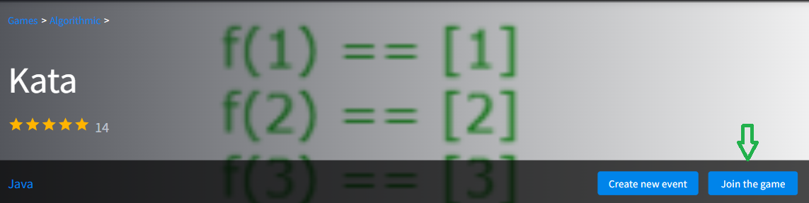

<meta charset="UTF-8">

## Summary

Kata is an interactive real-time game designed to teach prompt engineering. It is based on a series of small JavaScript challenges. Your goal is to solve them by writing prompts to the ChatAI expert.

## Key Features:

- **Interactive Tutorial Levels:**

  Learn the basics of prompt engineering by interacting with the ChatAI expert:

  - Write a prompt to the ChatAI expert, and it will provide a piece of code in return.
  - Improve your prompts to obtain the correct JavaScript functions.
  - Pass the tests to progress to the next level.

- **Progressive Challenges:** Level up your skills with increasingly complex prompt engineering tasks.
- **Prompt Modification Puzzles:** Practice modifying prompts to achieve specific outcomes.
- **Feedback Mechanism:** Receive instant feedback on the quality of your prompt modifications.
- **Scoring System:** Earn points for accuracy, efficiency, and creativity in using prompts.
- **Leaderboard:** Compete with other players and strive for the top spot on the leaderboard.
- **Multiplayer Challenges:** Work with other players in real-time to share strategies and solve challenges.

## How to play

### 1. Getting Started:

Log in to the site.

Select the game from the Game Collection.

Click the "Join the Game" button.

To return to the Game Collection, press the "Leave the Game" button.

### 2. Game Board and Code Editor:

There are two tabs in the middle of the screen: Game Board and Code Editor.

The Game Board tab displays the playing field with the current state of the game.

The Code Editor tab showcases a code editor containing an initial JavaScript function, a console presenting the results of the function execution, and three control buttons: Reset, Help, and Commit.

Your task is presented in a modal window.

Copy the task using the copy button.

Paste it into the AI Chat and press the "Add to context" button,  then click the "Ask Chat GPT". 

Copy the answer and paste it into the Code Editor.

If the function passes the tests, a notification will appear in the Console.

Click the Commit button to progress to the next level.

If the function doesn't pass the tests, refine your prompt and ask AI Chat again.

### 3. AI Chat

AI Chat is displayed on the right side of the screen.

You can type prompts or paste them using the "Copy" button.

To send your prompt to the AI Expert, click the "Add to context" button,  then click the "Ask Chat GPT". 

For creating a complex context, write several prompts and add them one by one to the context using the "Add to context" button. Afterward, click the "Ask Chat GPT" button.

Edit your prompts using the editing tool that appears when you hover over the message.

### 4. Leaderboard

Players earn points for solving challenges.

The leaderboard is displayed on the right side of the screen.

### 5. Room Chat and Field Chat

Room Chat and Field Chat are displayed on the left side of the screen.

Use them to collaborate with other players.

## What is context?

Context means the surrounding details or information that helps understand a situation or conversation better.

In language, it's the words or phrases around a particular word that give it meaning.

In natural language processing, context includes the words, phrases, or information that precedes or follows a specific word or passage, providing additional details that aid in interpretation. The context helps to disambiguate language and allows the model to generate more accurate and relevant responses.

For example, in a conversation, each statement or question builds upon the context of the previous ones. Understanding context involves considering the broader meaning and implications of the words used, as well as any relevant background information.

Enhancing context in communication with AI models often involves providing clear and detailed information, referring to previous statements, and structuring prompts to guide the model's understanding. Effective management of context allows for more coherent and contextually appropriate responses from language models.

## How to enhance context for better answers?

- **Provide Clear Instructions:** Clearly specify what kind of information or response you are looking for. The more specific your instructions, the better the model can tailor its response.
- **Add Background Information:** Include relevant background details or context that the model might need to understand the question or prompt better. This can help eliminate ambiguity.
- **Use Previous Responses:** If you are engaging in a conversation or series of prompts, refer back to previous responses. This helps maintain continuity and provides the model with a better understanding of the ongoing context.
- **Incremental Information:** Build up the context gradually by providing information in increments. Instead of giving all the details at once, feed the model information step by step.
- **Provide Examples:** Offer examples related to your query. Examples can help clarify your intent and guide the model in generating more accurate and relevant responses.
- **Ask Follow-up Questions:** If the initial response is not entirely what you're looking for, consider asking follow-up questions. This gives you the opportunity to refine the context and guide the model toward the desired information.
- **Be Explicit with Pronouns:** If your prompt includes pronouns like "it," "this," or "that," be explicit about what these refer to. This avoids potential confusion and ensures the model understands the context correctly.
- **Avoid Ambiguous Phrasing:** Ensure your prompts are clear and avoid ambiguous phrasing. Ambiguity can lead to varied interpretations, potentially resulting in responses that are not aligned with your expectations.

Good luck in prompting!
