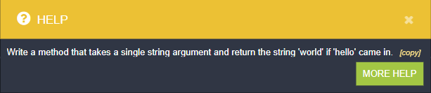

<meta charset="UTF-8">

## Summary

Kata is an interactive real-time game designed to teach prompt engineering. It is based on a series of small JavaScript challenges. Your goal is to solve them by writing prompts to the ChatAI expert.

## Key Features:

- **Interactive Tutorial Levels:**

  Learn the basics of prompt engineering by interacting with the ChatAI expert:

  - Write a prompt to the ChatAI expert, and it will provide a piece of code in return.
  - Improve your prompts to obtain the correct JavaScript functions.
  - Pass the tests to progress to the next level.

- **Progressive Challenges:** Level up your skills with increasingly complex prompt engineering tasks.
- **Prompt Modification Puzzles:** Practice modifying prompts to achieve specific outcomes.
- **Feedback Mechanism:** Receive instant feedback on the quality of your prompt modifications.
- **Scoring System:** Earn points for accuracy, efficiency, and creativity in using prompts.
- **Leaderboard:** Compete with other players and strive for the top spot on the leaderboard.
- **Multiplayer Challenges:** Work with other players in real-time to share strategies and solve challenges.

## How to play

### 1. Getting Started:

Log in to the site.

Select the game from the Game Collection.

Click the "Join the Game" button.

To return to the Game Collection, press the "Leave the Game" button.

### 2. Game Board and Code Editor:

There are two tabs in the middle of the screen: Game Board and Code Editor.

The Game Board tab displays the playing field with the current state of the game.

The Code Editor tab showcases a code editor containing an initial JavaScript function, a console presenting the results of the function execution, and three control buttons: Reset, Help, and Commit.

Your task is presented in a modal window.

Copy the task using the copy button.

Paste it into the AI Chat and press the Ask button.

Copy the answer and paste it into the Code Editor.

If the function passes the tests, a notification will appear in the Console.

Click the Commit button to progress to the next level.

If the function doesn't pass the tests, refine your prompt and ask AI Chat again.

### 3. AI Chat

AI Chat is displayed on the right side of the screen.

You can type prompts or paste them using the "Copy" button.

To send your prompt to the AI Expert, click the "Add to context" button, then click the "Ask Chat GPT" button.

For creating a complex context, write several prompts and add them one by one to the context using the "Add to context" button. Afterward, click the "Ask Chat GPT" button.

Edit your prompts using the editing tool that appears when you hover over the message.

### 4. Leaderboard

Players earn points for solving challenges.

The leaderboard is displayed on the right side of the screen.

### 5. Room Chat and Field Chat

Room Chat and Field Chat are displayed on the left side of the screen.

Use them to collaborate with other players.

